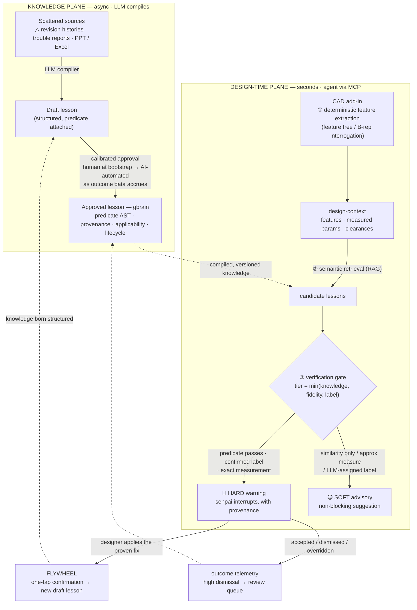

# SenpAI — Technical Architecture

*How we structure design knowledge, and how the AI agent uses it.*

SenpAI is a proactive AI agent for manufacturing designers: while you design, it pulls
relevant past lessons — buried in drawing revision histories (△ marks), trouble
reports, and veterans' heads — and interrupts you **before** you repeat a known
failure. Like a senior engineer watching over your shoulder.

This document describes the production architecture. The hackathon demo implements
the full loop end-to-end with a web-based pseudo-CAD viewer; the production path
replaces the viewer with a CAD add-in.

**Why edit time, and the integration sequence.** A batch check at PLM check-in
would be far easier to build (no add-in, no live extraction) — and it is exactly
where existing DFM tools already sit. We target the edit moment because of the
**asymmetry of correction cost**: at check-in the design is already converged and a
finding means rework; at edit time the designer applies the proven alternative
with one click (our demo shows this literally). The interruption moment is also
where the flywheel captures intent — a check-in gate can only reject, never ask
"why did you change this?" while the reason is still in the designer's head.
Integration is sequenced accordingly: **v1 commits to a single CAD platform** (the
one our first customer designs in — CATIA CAA, with NX Open and SOLIDWORKS API as
fast-follow; all are officially supported extension surfaces), and a **PLM
check-in gate ships alongside as the low-friction complement** — same brain, same
predicates, zero add-in required — for teams not yet on the add-in.

---

## Architecture at a glance



No LLM sits on the runtime path to a hard warning: the upper plane compiles and
certifies (human-certified at bootstrap, AI-certified as outcome data proves
calibration), the lower plane decides with predicates. The flywheel loops design
activity back into the knowledge plane — that is what keeps the map alive.

---

## 1. Design principle: LLMs compile, predicates decide

The core failure mode of an interrupting assistant is a false positive: **a senpai
who interrupts wrongly gets ignored forever.** Our architecture is built around one
asymmetry:

- **Recall failures (missed knowledge) are cheap** — the designer is no worse off
  than today.
- **Precision failures (wrong interruption) are fatal** — they destroy trust in the
  product.

Therefore: LLMs and semantic retrieval are responsible for **recall** (finding
candidate knowledge across messy, unstructured sources). The **decision to
interrupt** always passes a deterministic verification gate (machine-checkable
predicates over measured geometry). LLMs compile knowledge; predicates decide.

```
┌─ KNOWLEDGE PLANE (async, LLM-powered) ─────────────────────────────┐
│ Ingest: △ revision histories, trouble reports, PPT/Excel, minutes  │
│   → LLM compiler → structured lessons (stored in gbrain)           │
│   → lesson → executable check (predicate), human-approved          │
└────────────────────────────┬───────────────────────────────────────┘
                             ↓ compiled, versioned knowledge
┌─ DESIGN-TIME PLANE (seconds-scale, agentic via MCP) ───────────────┐
│ CAD add-in: geometric feature extraction (deterministic)           │
│   → agent: semantic retrieval (RAG) → verification gate            │
│   → HARD warning (predicate passed) or SOFT advisory (similarity)  │
│   → flywheel: capture the designer's decision as a new lesson      │
└────────────────────────────────────────────────────────────────────┘
```

---

## 2. Data model: the structured lesson

One lesson = one unit of executable design knowledge, stored as a **gbrain page**
(markdown body + structured frontmatter). Human-readable, machine-queryable,
git-auditable.

```yaml
# lesson frontmatter (schema v1)
id: L-2015-1
category: insufficient_strength      # taxonomy: strength / interference / manufacturability / ...
part_family: fastening_flange        # applicability by FEATURE CLASS, not part number
region_type: fastening_area          # geometric-semantic region
feature_type: plate
operation: thickness_change          # what design operation this lesson concerns
applicability:                       # scoped by the human approver — generalization is earned, not assumed
  material: steel                    # thresholds are functions of material/load; a steel lesson
  load_case: suspension_input        # does not hard-fire on an aluminum part
predicate: "region=fastening_area AND material=steel AND thickness_mm < 10"
severity: high
outcome: >
  FEM found stress concentration at the fastening area; 8mm plate failed
  fatigue criteria (SF 1.1 < 1.5). Fixed by 8→10mm (+120g).
provenance:
  source_rev: "2015 model △1"        # the revision mark this was learned from
  source_doc: "Strength Study Report FLG-2014-06"
  author: "Yamada (Design)"
  year: 2014
lifecycle:
  status: approved                    # draft → approved → superseded
  approved_by: "senior engineer"      # human gate before a lesson can HARD-interrupt
  valid_from: 2014-06
  superseded_by: null                 # bi-temporal: knowledge has generations too
confidence: verified                  # verified (predicate) / anecdotal (soft-only)
```

Key schema decisions:

- **Geometric signature** (`part_family`, `region_type`, `feature_type`,
  `operation`): lessons generalize by feature class, so knowledge learned on one
  flange applies to every fastening flange — not just the same part number.
- **`applicability` bounds the generalization.** A threshold learned on one steel
  flange under one load case is not a law of nature: the predicate vocabulary
  includes `material` and `load_case`, the approver explicitly scopes how far a
  lesson generalizes, and a cross-part match whose material/load context does not
  match the lesson's is **downgraded to a soft advisory**. Class-wide hard firing
  is earned through approval, never assumed.
- **`predicate`**: the "executable skill." A lesson without a predicate can still be
  retrieved and shown — but only as a soft advisory, never as a hard interruption.
  The predicate language is a **closed, declarative expression language** — stored as
  a JSON AST over a fixed vocabulary (feature attributes, comparison and boolean
  operators), with no function calls and no arbitrary code. The string form above is
  display syntax only. LLM-emitted predicates are schema-validated at compile time,
  rejected if they reference attributes Stage ① cannot measure, and versioned
  together with their lesson. Nothing is ever `eval()`ed: the evaluator is a small
  interpreter over the AST — this is what makes the verification gate deterministic
  and auditable, and it is what the human approver actually approves.
- **`lifecycle` with supersession**: knowledge itself has revision history (a 2015
  steel-era lesson may be superseded by a 2022 aluminum guideline). gbrain's
  bi-temporal facts model supports this natively.
- **`provenance`**: every warning cites the △, the document, and the person. The
  agent never asserts knowledge it cannot attribute.

### Why gbrain as the knowledge store

We deliberately did not build a custom knowledge database:

| Need | gbrain provides |
|---|---|
| Structured + human-readable storage | Markdown pages with typed frontmatter |
| Semantic retrieval | Postgres + pgvector embedding search (proven stack) |
| Knowledge generations / supersession | Bi-temporal facts (`valid_from` / `superseded_by`) |
| Provenance graph (△ ⇄ docs ⇄ people) | Page links = the "living map" |
| **Agent access** | **Built-in MCP server (`gbrain serve`)** — no custom protocol work |
| Team sharing | Shared Postgres (Supabase) backend, already running for our team |

---

## 3. Knowledge plane: the compiler pipeline

```
raw documents ──→ [LLM extraction] ──→ draft lesson ──→ [human approval] ──→ approved lesson
 (△ tables,          Claude:              status:draft      senior engineer      predicate active,
  reports, PPT)      doc → schema                           reviews predicate    agent may interrupt
```

1. **Extraction (LLM, batch).** Claude reads a trouble report / revision table and
   emits a lesson in the schema above. This is the scene shown live in the demo
   ("Knowledge Compiler": Japanese report in, structured lesson out in seconds).
2. **Linking.** The △ mark acts as the **link key**: terse revision annotations
   ("△1 thickness +2mm for strength") point to the richer documents where causal
   knowledge lives. We compile the documents; the △ anchors them to geometry and
   generations.
3. **Calibrated approval gate — human at bootstrap, automated by design.** A
   lesson's predicate must be approved before it can hard-interrupt anyone. At
   bootstrap the approver is a senior engineer (the review cost is minutes per
   pre-structured lesson) — but the gate is explicitly **transitional, not
   permanent**. Every approval decision and every warning outcome (§5) is training
   data for the approval function itself: once a lesson class demonstrates
   sustained precision in production (low dismissal rate, no overrides), new
   lessons in that class are **auto-approved by AI**, and humans retreat to novel
   and high-severity classes. The endgame is an approver that has seen every
   outcome of every past approval — something no single human reviewer can match.
   The same gate handles **consolidation**:
   draft lessons sharing a dedup key (`part_family × region_type × operation`) are
   presented as merge candidates, and contradictions are resolved by superseding the
   older lesson (§2 lifecycle) — so the brain converges instead of accumulating
   near-duplicates as the flywheel turns.

**The approval gate does not gate value delivery.** Senior-engineer time is the
scarce resource this product exists to preserve, so the gate is scoped narrowly:
approval is required only to *promote* a lesson to hard-warning status — unapproved
lessons ship immediately as soft advisories with provenance, so knowledge flows
while the queue drains. Throughput math: reviewing a pre-structured lesson takes
minutes (read outcome, check predicate, scope applicability) versus the hours the
lesson took to learn the hard way. The queue is prioritized by expected firing
frequency (lessons matching active part families first), delegation is tiered
(senior engineers approve high-severity lessons; experienced designers approve the
rest), and stale drafts auto-expire to the soft tier rather than blocking the
pipeline.

---

## 4. Design-time plane: how the agent uses the brain

Designers think while they design; a few seconds of latency is acceptable. This lets
the runtime be **fully agentic**: the CAD add-in only extracts facts, and the SenpAI
agent orchestrates retrieval → verification → response via MCP.

### Stage ① Geometric feature extraction (deterministic, CAD-side)

Triggered on edit pauses (debounced). Produces a **design-context document**:
`{part_family, region, feature, operation, measured params, adjacent-part clearances}`.

Real-world CAD data is heterogeneous, so extraction is tiered:

| Model class | Method | Fidelity |
|---|---|---|
| **Parametric** (feature tree exists) | Feature tree + dimension APIs; parametric diff of the edit | High (exact) |
| **Dumb geometry** ("stitched surfaces", imported/legacy) | B-rep interrogation: curvature-based face classification (fillet detection), ray/midsurface sampling (effective thickness), hole/boss recognition | Medium (measured, approximate) |
| **Semantic labeling** (is this region a *fastening area*?) | Geometric heuristics (bolt-hole pattern + fastener contact) + LLM/VLM assist from context (part name, assembly neighbors, drawing notes); cached per part revision | Tagged with **label provenance** |

Label provenance closes the last LLM leak into hard warnings: **a region label
assigned by LLM/VLM assist caps that region's warnings at SOFT until the label is
confirmed** by geometric heuristics or a human (confirmation is cached per part
revision, so it is paid once). Only heuristic- or human-confirmed labels can
satisfy a hard-warning predicate — the "LLMs compile, predicates decide" principle
holds for labels, not just measurements.

B-rep interrogation on dumb geometry is proven territory — commercial DFM checkers
do exactly this today. Our novelty is not the geometry analysis; it is what the
analysis is checked *against*.

### Stage ② Semantic retrieval (RAG — this is where LLM/embeddings earn their keep)

The design-context document is embedded and matched against the lesson corpus in
gbrain (pgvector), with metadata filters (`part_family`, `region_type`,
`operation`). Shape semantics are fuzzy — "thinning a mounting plate" and
"reducing flange thickness" must retrieve the same lesson. Recall is won here.

### Stage ③ Verification gate (deterministic — precision is won here)

For each candidate lesson, its `predicate` is evaluated against Stage ①'s measured
values. The warning tier follows one rule:

> **warning tier = min(knowledge confidence, extraction fidelity, label provenance)**

| Predicate passes on high-fidelity measurement | 🔴 **HARD warning** — the senpai interrupts, with provenance |
|---|---|
| Predicate passes on approximate measurement (dumb geometry) | 🟡 SOFT advisory — "worth checking: measured ~8mm here" |
| No predicate, but high semantic similarity | 🟡 SOFT advisory — "a similar case exists: 2015 △2" |
| Neither | silence |

A false positive on a soft advisory costs nothing (ignore it); a hard interrupt is
reserved for verified knowledge on reliable measurements. Trust is preserved by
construction, on both the knowledge side and the geometry side.

### Stage ④ Response composition (LLM)

The agent composes the senpai-voice message from the verified lesson: what happened,
which △, which document, who solved it, what the proven alternative is. The LLM
writes the *prose*, never the *facts* — all facts come from the matched lesson.

### MCP surface

The agent reaches the brain through MCP — gbrain's built-in server plus a thin
product layer (4 tools):

| Tool | Plane | Role |
|---|---|---|
| `check_design(context)` | design-time | Stage ②+③: retrieve candidates, evaluate predicates, return tiered findings |
| `explain_warning(lesson_id)` | knowledge | Deep provenance: △ → documents → people (the living map) |
| `capture_decision(change, reason)` | write path | Flywheel: persist a confirmed design decision as a draft lesson |
| `compile_lessons(doc)` | knowledge | Batch compilation: document → draft lessons |

---

## 5. The flywheel: knowledge that grows as you design

When a designer accepts a change (e.g., applies the recommended relief shape), the
agent asks **one confirmation question** ("The reason is clearing the battery
bracket, correct?"). One tap, and a new structured lesson — with geometry context,
operation, reason, author, and generation — lands in the brain as a draft.

**The flywheel also turns on negative signal.** Every warning outcome is recorded:
`accepted` / `dismissed` / `overridden (with reason)`. Lessons with high dismissal
rates lose confidence and enter a review queue automatically — the same senior
engineers who approve lessons see which ones the floor is ignoring. This gives us an
operational false-positive metric (dismissal rate per interruption), the error
budget for the one failure mode we declared fatal in §1.

This is the moat: every existing tool (CoLab AutoReview, Leo AI, CADDi) **reads**
formalized knowledge. None **capture** it at the moment of design. With SenpAI, the
act of designing itself feeds the next generation's brain — positive and negative
signal both — the map stays alive, and the customer's switching cost compounds with
every design session.

---

## 6. Evaluation: backtesting on the company's own history

"Does it work?" is measurable before any pilot, because revision history is a
**labeled evaluation set**: every cross-generation recurrence that actually happened
is a ground-truth positive the system should have caught.

The backtest protocol (scoped to what history can actually answer):

1. **Freeze the clock at year N.** Compile the brain only from documents and △
   entries dated ≤ N.
2. **Replay the △ table, not full sessions.** Each later △ entry records a design
   operation with its parameter change ("thickness 10→8mm on the fastening area") —
   enough to evaluate predicates against. Full session replay (with measured
   clearances from Stage ①) requires per-generation CAD archives; where a customer
   retains them, the backtest extends to full extraction replay — a named
   dependency, not an assumption.
3. **Score recall — recurrence catch rate:** of the recurrences that historically
   happened after year N, what fraction would have triggered a hard warning at the
   moment of the recorded parameter change? (Our demo's 2015→2020 plate-thickness
   recurrence is exactly one such test case — and the system catches it.)

**What history cannot measure: precision.** Warnings that a designer would have
dismissed were never recorded, so a historical false-positive rate would be
survivorship-biased. Precision is therefore measured live, post-deployment, as the
dismissal-rate metric from §5 — recall from the archive, precision from production.

This is the same discipline as backtesting a trading strategy: no customer pilot is
needed to produce the first credibility number — a customer's own △ archive is the
benchmark. It also defines our first engagement deliverable: "give us N years of
revision history, and we will show you the recurrences we would have caught."

## 7. Data security & deployment

CAD data is crown-jewel IP, and in real OEMs it lives on-premises. Design-change
records live across internal systems (mostly on-prem); documents live on internal
shares and corporate SharePoint. SenpAI is designed for that reality:

- **The whole brain deploys inside the customer's perimeter** — gbrain (Postgres +
  pgvector), the MCP server, and the compilation pipeline all run on-prem or in the
  customer's private cloud. This is not a "send us your data" SaaS.
- **Geometry never leaves CAD.** The add-in extracts a compact design-context
  document (feature types, measured parameters, clearances) — the B-rep itself is
  never transmitted, not even in-tenant, beyond the extraction step.
- **Connectors, not migration.** Lessons are compiled from where documents already
  live: PLM/PDM systems, internal file shares, SharePoint. The brain stores the
  structured lesson + a provenance link, not a copy of every source system.
- **LLM calls** go to enterprise endpoints with contractual no-training guarantees,
  or to in-tenant models where the customer requires it. The architecture is
  model-agnostic by construction (the LLM only compiles and phrases; it holds no
  state).

## 8. What the demo shows vs. the production path

| Component | Demo (today) | Production |
|---|---|---|
| CAD surface | Web pseudo-CAD (three.js), named parameters | CAD add-ins (CATIA CAA / NX Open / SW API), tiered extraction (§4-①) |
| Matching | 2 predicate rules (R1/R2), local, zero false positives | Full 3-stage pipeline (retrieve → verify → compose) |
| Warning text | Pre-generated (demo determinism) | LLM-composed from matched lessons (§4-④) |
| Knowledge store | lessons.json | gbrain (Supabase Postgres + pgvector), shared team brain |
| Compiler scene | Live: Japanese report → structured lesson JSON | Same pipeline, batch + human approval gate |
| Flywheel | Live: confirm → graph node appears | Same, writes draft lessons via MCP |

Everything in the demo is a truthful, working miniature of this architecture: the
warning moment, the compiler, and the flywheel all execute end-to-end today.

---

## 9. Why this is credible

1. **No magic in the hot decision.** Interruptions require deterministic predicate
   passes on measured geometry. LLM hallucination cannot produce a hard warning.
2. **Boring, proven infrastructure.** B-rep feature interrogation (DFM-proven),
   Postgres + pgvector, markdown + git audit trail, MCP as the agent protocol.
3. **Honest about messy reality.** Tiered extraction assumes real factories have
   both parametric models and stitched-surface legacy data — and degrades warning
   strength instead of guessing.
4. **Certification is earned, then automated.** At bootstrap, humans certify what
   interrupts humans — quality control while the system has no track record. As
   outcome telemetry accumulates, approval automates class by class, because the AI
   approver has seen every consequence of every past approval — something no single
   human reviewer can match. The gate's cost trends to zero; its guarantee does not.
5. **The team lives this problem.** We work inside a major automotive OEM; the
   recurrence chain in our demo data mirrors what we see at work.

### Known risk: predicate yield

The load-bearing unknown is **yield** — what fraction of real shop-floor documents
compile into predicate-bearing lessons that can hard-warn. Our validation plan: run
the compiler on 50 real drawings' revision histories and their linked reports, and
measure (a) the fraction that produce an approvable predicate and (b) extraction
accuracy. **If yield lands under ~30%, hard warnings cannot be the lead feature**
and we pivot the wedge toward compiling trouble reports (△ as link key only).

The architecture degrades gracefully either way: low-yield knowledge still ships as
soft advisories with provenance, and the flywheel raises yield over time by
construction — knowledge captured at design time is born structured, with its
context and predicate fields filled at the source instead of reverse-engineered
from prose. We state this risk because it defines our first post-hackathon
experiment, not because the architecture depends on winning it.
